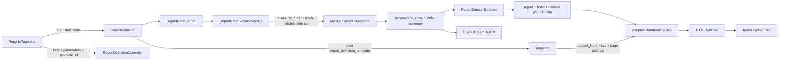

# Quy tắc triển khai báo cáo mới

Tài liệu này là hướng dẫn nhập môn chuẩn cho agent tiếp nhận một báo cáo PMS mới. Nó gom kiến trúc và hợp đồng hiện tại để không cần đọc toàn bộ mã nguồn các báo cáo cũ. Sau khi đọc tài liệu này, chỉ đọc chứng cứ legacy của báo cáo đang làm và tối đa một mẫu code gần nhất.

## 1. Thứ tự đọc khi bắt đầu phiên mới

1. Đọc `.codex/PROJECT_MEMORY.md` để biết trạng thái hiện tại và rủi ro đã biết.
2. Đọc `.codex/docs/reports/report_creation_rules.md` này.
3. Đọc đúng tài liệu/chứng cứ của báo cáo được giao: dòng trong workbook, ảnh giao diện cũ, stored procedure gốc, schema bảng liên quan và các ghi chú đã xác minh. Không cần đọc tất cả tài liệu báo cáo khác.
4. Chọn một ví dụ gần nhất theo nhu cầu:
   - Tích hợp report/source/template qua migration: `backend/database/migrations/2026_09_18_100000_create_sales_invoices_report.php`.
   - Template Designer và header chuẩn: `backend/database/report_templates/minibar_invoices_by_product_reference.php`.
   - Dataset phụ được tính sau procedure: `backend/app/Services/Reports/DepositsSaleDataAdapter.php`.
5. Chỉ mở các file trong bản đồ ở mục 3 khi phần việc thực sự chạm đến chúng. Không quét hoặc chỉnh hàng loạt báo cáo để bắt đầu một report mới.

## 2. Kiến trúc đang chạy



- Một `ReportDefinition` trỏ tới một `ReportDataSource` và liên kết một hoặc nhiều `Template` qua `report_definition_template`.
- `ReportDataSource` mô tả MySQL stored procedure, tham số đầu vào, field, sample parameters và giới hạn dòng.
- `ReportDefinition.parameter_ui_schema` định nghĩa filter và vị trí menu.
- `Template.content_json` là cấu hình Designer; `content_html` là HTML đã biên dịch và được runtime dùng; `css` cùng thông số trang được lưu trên template.
- Metadata/report data nằm trên connection ứng dụng/chi nhánh đang hoạt động. `SwitchBranchDatabase` xử lý đổi DB theo chi nhánh. `mysql_system` là DB hệ thống dùng cho dữ liệu hệ thống đã được xác minh; không tự giả định bảng nghiệp vụ thuộc DB này.
- API báo cáo đã nằm trong nhóm `auth:sanctum` và `EnsureBranchAccess`. Dùng các endpoint hiện có; report thông thường không cần route hoặc trang frontend riêng.

## 3. Bản đồ file chuẩn

| Trách nhiệm | File hiện tại | Quy tắc khi tạo report mới |
|---|---|---|
| Report catalogue, execute/render/export | `backend/app/Http/Controllers/Api/ReportDefinitionController.php` | Dùng luồng hiện có; không thêm nhánh report-specific vào controller nếu có thể dùng procedure/adapter. Đây là file dùng chung. |
| Khám phá procedure | `backend/app/Services/Reports/ReportProcedureCatalogService.php` | Chỉ nhận procedure hợp lệ theo prefix `rpt_` và quyền truy cập dữ liệu đọc. |
| Gọi procedure, cast tham số, giới hạn dòng | `backend/app/Services/Reports/ReportDataExecutorService.php` | Contract dùng chung; chỉ trả result set dạng bảng đầu tiên. Không sửa chỉ để thêm một report thông thường. |
| Dataset hậu xử lý | `backend/app/Services/Reports/ReportDatasetEnricher.php` | Chỉ đăng ký nhánh mới khi report cần dataset dẫn xuất; file dùng chung nên phải nêu impact và xin duyệt trước khi sửa. |
| Adapter đặc thù | `backend/app/Services/Reports/<Report>DataAdapter.php` | Dùng khi cần gom/đổi shape dữ liệu sau procedure; giữ nghiệp vụ trong adapter report-specific. |
| Thay placeholder, render hàng động, nhóm và tổng | `backend/app/Services/TemplateRendererService.php` | Renderer dùng chung; không thêm điều kiện report-specific nếu cấu hình Designer hoặc adapter giải quyết được. |
| Xuất file | `backend/app/Services/Reports/ReportExportService.php`, `ReportSpreadsheetExportService.php` | Tận dụng các format đang có; kiểm tra riêng cấu trúc export của report. |
| API routes | `backend/routes/api.php` | Các endpoint report/source/template đã tồn tại. Đây là file dùng chung; chỉ sửa khi endpoint hiện tại không đáp ứng và đã nêu impact. |
| Runtime UI | `frontend/src/pages/reports/ReportsPage.vue` | Tự tải report/filter từ metadata; tránh hardcode report mới ở đây. File dùng chung mọi report. |
| Menu động | `frontend/src/layouts/MainLayout.vue` | Lấy `show_in_menu`, `menu_locations` và thứ tự từ report definition. Không thêm menu tĩnh nếu metadata đủ. |
| Cấu hình data source | `frontend/src/pages/config/components/hotel/ReportDataSourceManagerModal.vue` | Khám phá procedure, chạy sample, lưu nguồn và refresh schema. |
| Cấu hình report/filter/menu | `frontend/src/pages/config/components/hotel/ReportDefinitionManagerModal.vue` | Gán source, filter, templates, template mặc định và vị trí menu. |
| Thiết kế mẫu | `frontend/src/pages/config/components/hotel/TemplateEditorModal.vue` | Designer dùng chung mọi report; ưu tiên cấu hình block riêng trong `content_json`. Chỉ sửa sau khi xin duyệt và báo rõ phạm vi ảnh hưởng. |
| Reference template | `backend/database/report_templates/<report>_reference.php` | Giữ `content_json`, `content_html`, `css` và thiết lập trang đồng bộ. |
| Cài đặt report/source/template | `backend/database/migrations/<timestamp>_create_<report>_report.php` | Tạo/cập nhật procedure và metadata trên các DB chi nhánh theo pattern hiện tại. Không chạy migration vào DB thật nếu chưa được giao/cho phép. |
| Đặc tả report | `.codex/docs/reports/<report>.md` | Ghi source, tham số, mapping, logic, template/API và phần chưa xác minh. |

## 4. Nguồn sự thật và bảo toàn hành vi legacy

- Bắt đầu từ đúng report trong workbook/danh mục. Xác nhận tên, vị trí menu, tham số, cột, nhóm, tổng, UX thao tác và định dạng xuất của hệ thống cũ.
- Tìm đúng stored procedure/database legacy theo khách sạn/chi nhánh; các khách sạn có thể có các phiên bản procedure khác nhau. Không chọn bản gần tên mà chưa xác minh nội dung.
- Đọc schema legacy trong `old_database_struct/` để biết cột, khóa và quan hệ; đây là tài liệu tham khảo, không phải schema runtime mới.
- Nếu có SSMS/database legacy, so sánh trực tiếp procedure và dữ liệu với ảnh/UI. Nếu không có, ghi rõ điều nào suy ra từ tài liệu và đánh dấu chưa xác minh.
- Lập bảng mapping: `legacy procedure/cột` → `MySQL table/cột hoặc biểu thức` → `alias output` → `binding template`.
- Không tự suy luận khóa import, quan hệ, giá trị mã, ngày nghiệp vụ hoặc ý nghĩa khoản tiền. Ghi `Chưa xác minh` đến khi có chứng cứ.
- Giữ nguyên quy tắc legacy đã xác minh: thời điểm lọc, cách tính tiền/thuế/hoàn trả, phân loại, sắp xếp, nhóm, dòng 0/âm/hủy, điều kiện quyền xem và các thao tác UX.
- Trước khi thêm/sửa bảng, model, migration bảng, FK, seeder hoặc import mapping, đọc `.codex/docs/database_mapping/README.md`; cập nhật `TABLE_MAP.md` và trang của bảng tương ứng trong cùng thay đổi. Không thay đổi schema chỉ để làm report nếu procedure đọc dữ liệu hiện có đáp ứng được.

## 5. Stored procedure và ReportDataSource

### Stored procedure

- Tên theo dạng `rpt_<lower_snake_case>`, khai báo `READS SQL DATA` hoặc `NO SQL`. Catalog từ chối tên không có prefix cấu hình `reporting.procedure_prefix` (mặc định `rpt_`) hoặc routine có quyền ghi dữ liệu.
- Procedure phải chỉ đọc dữ liệu và tự thực hiện đầy đủ filter, quyền/phạm vi, joins, quy tắc business, nhóm, sort và alias cần thiết. Executor không tự áp điều kiện lọc report.
- Dùng parameterized `IN` parameters theo đúng thứ tự trong `parameter_schema`. Runtime yêu cầu mọi key có mặt, kể cả filter tùy chọn; giá trị rỗng được chuyển thành `NULL`. Chỉ `IN` được hỗ trợ.
- `multi-select` ở frontend được gửi thành chuỗi mã phân cách bằng dấu phẩy. Procedure phải parse đúng định dạng đó; không gửi chuỗi UI label.
- Alias kết quả phải ổn định và khớp chính xác với `columns[].value`, group field, adapter và tổng trong template. Đổi alias phải cập nhật tất cả binding và schema cùng lúc.
- Procedure nên trả một result set dạng bảng duy nhất. Executor hiện chỉ tiêu thụ result set đầu tiên.
- `max_rows` mặc định lấy từ cấu hình reporting (hiện mặc định 1.000, trần cấu hình 5.000). Trả đúng dữ liệu cần cho báo cáo, tránh query không giới hạn.
- An toàn SQL: kiểm tra/allowlist sort column và hướng sort; không nối trực tiếp input người dùng vào SQL động. Dùng whitelist giá trị và prepared parameters.

### ReportDataSource metadata

- `parameter_schema`: tham số procedure theo đúng thứ tự; lưu tên, `mode=IN`, `data_type` và metadata liên quan.
- `field_schema`: alias/type output. Màn hình có thể khám phá bằng sample procedure; khi sample không có dòng, driver metadata có thể thiếu/sai alias nên phải kiểm tra procedure và template.
- `sample_parameters`: giá trị kiểm tra an toàn, đại diện cho khoảng ngày và filter report.
- `max_rows`, `is_active`, `name`, `description`, `schema_name`, `object_name` phải được khai báo.
- Luồng hiện tại trả dataset dạng:

```json
{
  "parameters": {},
  "rows": [],
  "summary": { "row_count": 0, "truncated": false },
  "fields": [{ "name": "FieldAlias", "type": "string", "nullable": true }]
}
```

- `fields` phục vụ CSV/schema và fallback export; không thay cho alias thực tế trong từng row.

## 6. Filter UI và menu report

- Filter do `ReportDefinition.parameter_ui_schema` cấu hình, không hardcode trực tiếp trong `ReportsPage.vue`.
- `parameter_ui_schema` phải phủ các tham số của `parameter_schema`. Tên tham số phải trùng tuyệt đối; giữ thứ tự có ý nghĩa cho UI dễ dùng.
- Control hiện hỗ trợ: `text`, `number`, `date`, `date-range`, `datetime-local`, `select`, `multi-select`, `radio`, `checkbox`, `hidden`.
- Với `date-range`, khai báo tham số ngày đầu là control hiển thị và `range_end_parameter` trỏ tới tham số ngày cuối (thường hidden); cả hai vẫn phải được procedure nhận.
- Default ngày đã hỗ trợ: `$today`, `$yesterday`, `$month_start`, `$month_end`. Các control select/radio nên có default hợp lệ hoặc option đầu tiên có ý nghĩa.
- Option tĩnh dùng `{ "label": "...", "value": "..." }`; option động chọn `options_source` đã có. Danh sách cho phép hiện tại: `areas`, `outlets`, `companies`, `bookings`, `rooms`, `room-classes`, `registration-statuses`, `users`, `hotel-services`, `report-shifts`, `service-departments`.
- Nếu cần một lookup mới, xác minh nguồn và quyền dữ liệu trước. Thêm lookup tác động `ReportLookupController` và validation schema dùng chung; phải nêu report nào khác bị ảnh hưởng và xin duyệt trước khi sửa.
- Khai báo `show_in_menu`, `menu_locations` (`reservation`, `frontdesk`, `housekeeping`), group và các trường thứ tự menu. Definition cần `is_active=true` để xuất hiện trong catalog runtime.
- Mọi filter business phải được thực thi trong procedure. UI chỉ thu thập giá trị; UI không bảo vệ dữ liệu nếu procedure bỏ qua filter.

## 7. Enrichment và dataset phụ

- Đưa phép tính nghiệp vụ có thể biểu diễn rõ trong SQL vào procedure để một dataset có thể được kiểm tra độc lập.
- Dùng adapter riêng khi cần đổi shape để trình bày, gom từ `rows` thành danh sách phụ, escape giá trị hoặc cung cấp cấu trúc nhiều bảng cho template.
- Adapter phải thuần theo dataset khi có thể, xử lý mảng rỗng/null và giữ kiểu số cho amount/count.
- Đăng ký adapter trong `ReportDatasetEnricher` bằng report/source code cụ thể. Không thêm logic đó vào controller hoặc renderer tổng quát.
- `TemplateRendererService` tự tạo `aggregate.<list>.count`, `aggregate.<list>.sum.<field>` và `aggregate.<list>.distinct_count.<field>` cho các dataset dạng list. Chỉ dựa vào công thức này khi field số đã trả đúng numeric value.
- Nếu report cần nhiều result sets trực tiếp từ procedure, đây không được hỗ trợ bởi executor hiện tại. Thiết kế một dataset đơn hoặc adapter/query riêng; nếu bắt buộc đổi executor thì đó là thay đổi shared, phải xin duyệt và mô tả report khác chịu ảnh hưởng.
- Nếu có thể chọn template khác sau khi chạy, dữ liệu cần thiết cho mọi template phải có trong `data` từ lần execute; endpoint `render` chỉ render lại template trên data được gửi, không chạy lại procedure.

## 8. Template Designer và binding

### Nguồn lưu

- `content_json` là cây block Design gồm các band `header`, `detail`, `footer`; cột có thể chứa block lồng. Đây là cấu hình cần cập nhật khi sửa layout.
- `content_html` là bản biên dịch được report runtime render. Không chỉ sửa `content_json` rồi để HTML cũ, hoặc chỉ sửa HTML mà JSON vẫn sai.
- Khi cập nhật mẫu trong Designer, lưu cả JSON/HTML/CSS/page settings. Khi migration cập nhật cấu hình, cũng phải biên dịch và lưu HTML tương ứng.
- Runtime thay placeholder và dựng detail/group rows trên HTML đã lưu; không biên dịch lại từ `content_json` mỗi lần mở report.
- Template gồm `page_size`, `page_orientation`, `margin_top/right/bottom/left`, `parameter_defaults`, `content_json`, `content_html`, `css` và `report_data_source_id`.

### Block và binding

- Dùng band `header` cho logo/thông tin/ngày/tiêu đề/kỳ; `detail` cho bảng/chỉ số; `footer` cho ghi chú/chữ ký.
- Dùng header columns 30%/70% cùng lớp `hotel-logo`, `hotel-information` và divider theo mẫu chuẩn khi report cần header khách sạn; title/period vẫn theo report.
- Dòng chi tiết dynamic table dùng `type: table`, `dataSource: rows`, cột bind `row.<Alias>`. Group fields phải có trong alias procedure.
- Dataset phụ dùng `dataSource` đúng key mà adapter tạo, ví dụ `currency_allocations`; binding dòng dùng `item.<Field>` cho table block theo contract của block đang dùng.
- Binding ngữ cảnh chuẩn: `{{report.generated_at}}`, `{{report.generated_by}}`, `{{hotel.address}}`, `{{parameters.p_from_date}}`; dữ liệu dòng dùng `{{row.Field}}`; số dùng `|number` khi cần định dạng hiển thị.
- Tổng thường bind `aggregate.rows.sum.Amount` hoặc `aggregate.<dataset>.sum.<Field>`; kiểm tra field/dataset tồn tại khi không có dòng.
- Hàng nhóm, custom row và bảng phụ phải dùng đúng cấu hình block/marker mà `TemplateRendererService` hỗ trợ. Không tự viết markup rồi cho rằng renderer hiểu cấu trúc ngoài contract.
- Bảng có nhiều hàng/cột nên lưu width, headerStyle, cellStyle, group/custom row style trong Designer JSON; HTML/CSS là output, không thay thế cấu hình Design.
- CSS chỉ dùng cho quy tắc không thể cấu hình thành block/style (ví dụ page break/table rules). Tránh selector theo vị trí hàng nếu màu phải ổn định theo loại hàng.
- Kiểm tra preview, bản in và từng format export riêng. XLSX có đường xuất dựa HTML và fallback từ fields/rows; DOCX hiện tái dựng bảng dữ liệu đơn giản nên có thể không giống layout Designer phức tạp.

### Designer shared-file boundary

- `TemplateEditorModal.vue` là component dùng chung cho mọi report. Thay đổi compiler, block normalizer, canvas, inspector hoặc serialization có thể đổi hành vi của tất cả template.
- Trước khi sửa file dùng chung, trình bày rõ: file dự kiến sửa; chức năng hiện tại cần thay đổi; các report/component khác bị ảnh hưởng; phạm vi kiểm tra. Chờ user duyệt trước khi sửa.
- Ưu tiên cấu hình riêng trong reference template/migration nếu Designer hiện tại đã diễn đạt được yêu cầu.

## 9. Tích hợp migration

- Tên file theo timestamp của project, ví dụ `YYYY_MM_DD_HHMMSS_create_<report>_report.php`; procedure, source, template và definition phải có mã ổn định, nhất quán.
- Các bảng `report_data_sources`, `report_definitions`, `templates`, `report_definition_template` đã có migration nền tảng. Không tạo lại bảng cho report mới.
- Tạo/thay `rpt_*` trên connection đích mà migration runner cung cấp. Mỗi lần chạy migration phải chỉ dùng `DB::getDefaultConnection()` hiện hành; không hardcode alias (ví dụ HKT1–HKT4), không duyệt `database_domains.branch_connections` để sửa các DB khác và không mặc định branch mới đã có alias riêng trong config.
- Migration mẫu thường được runner thực thi riêng trên từng branch database: tạo procedure; upsert `report_data_sources`; tạo template từ `backend/database/report_templates/<report>_reference.php`; upsert `report_definitions`; lấy ID và upsert pivot `report_definition_template` với template mặc định. `up()` và `down()` đều chỉ tác động DB đích của lần chạy hiện tại.
- Lưu JSON bằng `JSON_UNESCAPED_UNICODE`; giữ `content_json` và `content_html` tương thích. Thêm `created_at`/`updated_at` theo schema.
- Có thể dùng `updateOrInsert` với stable code/report key để cài mới có tính lặp lại; nhưng phân biệt migration cài mới và migration hiệu chỉnh. Không ghi đè toàn bộ template đã được người dùng chỉnh chỉ để đổi một block. Patch theo ID/field cần thiết và giữ detail/footer, CSS, margins, title/period không thuộc yêu cầu.
- Chống chạy lặp trên nhiều alias cùng trỏ một DB khi phù hợp; tham khảo `visitedDatabases` trong migration hiện tại. Không giả định mỗi branch connection trỏ một database khác nhau.
- Không nuốt lỗi migration bằng `catch` rỗng. Nếu cho phép các branch độc lập, log connection/database và lỗi cụ thể; phải báo rõ branch nào không cập nhật. DDL MySQL có thể commit độc lập, nên không coi transaction bọc mọi branch là rollback nguyên tử.
- `down()` không xóa dữ liệu thiết kế do người dùng sửa nếu migration không sở hữu hoàn toàn dữ liệu đó. Nêu rõ cách rollback và ảnh hưởng.
- Branch mới được provision bằng chạy các migration hiện có qua `TenantDatabaseService::migrateBranchDatabase`; migration report phải an toàn khi gặp database chưa có data report và không phụ thuộc dữ liệu mẫu riêng của một branch. Vì runner chạy migration trên DB vừa provision, các migration báo cáo có trong code sẽ được tạo trên DB đó mà không cần thêm alias cố định.
- Sửa source của migration đã được ghi nhận trong bảng `migrations` không tự chạy lại migration đó trên DB hiện hữu. Khi cần áp dụng lại, xác định rõ quy trình rerun/reset và phạm vi DB; không tự ý reset dữ liệu.
- Tạo migration file không có nghĩa migration đã chạy. Chỉ chạy lên DB khi nhiệm vụ cho phép; ghi chính xác connection nào đã/ chưa cập nhật.

## 10. Quy trình làm report mới

1. **Chốt scope:** mã/row workbook, khách sạn/chi nhánh, UI legacy, filters, columns, groups, totals, export và nơi xuất hiện menu.
2. **Xác minh source:** đọc đúng stored procedure và schema legacy; xác định các source table, joins, filter date, alias, sort, các ngoại lệ business. Liệt kê phần chưa có chứng cứ.
3. **Thiết kế contract:** chốt `ReportDefinition.code`, `ReportDataSource.code`, procedure name, input parameters/type/order/defaults, output aliases/types và dataset phụ.
4. **Viết procedure MySQL:** dùng đúng database/table mới đã xác minh; tái hiện logic legacy; trả 1 result set ổn định; áp tất cả filter ở SQL; chỉ đọc.
5. **Thử mẫu dữ liệu:** dùng sample parameters đại diện; xác nhận lỗi SQL, tên/case alias, zero row, null, số âm/0, ngày đầu/cuối và giới hạn dòng. Dùng SSMS/legacy làm đối chiếu nếu có quyền truy cập.
6. **Định nghĩa DataSource:** đồng bộ tham số từ metadata procedure; lưu sample parameters, fields, max_rows, active state.
7. **Định nghĩa template:** tạo reference PHP với Designer JSON, HTML biên dịch, CSS tối thiểu, page setup, header/footer, cột và binding.
8. **Định nghĩa report:** tạo parameter UI schema, menu settings, sort/group, gán template và chọn default template.
9. **Thêm adapter nếu cần:** chỉ khi SQL result chưa đủ cho dataset phụ/presentation; đăng ký nhánh report-specific trong enricher sau khi đã xin duyệt sửa file dùng chung.
10. **Tạo migration triển khai:** đồng bộ procedure/source/template/report/pivot trên branch DB áp dụng; bảo vệ template đã được chỉnh; không chạy DB migration nếu chưa được giao.
11. **Ghi đặc tả:** tạo `.codex/docs/reports/<report>.md`; thêm nguồn/chứng cứ, mapping, tham số, logic, output bindings, API, trạng thái migration và Known Risks.
12. **Nghiệm thu:** đối chiếu legacy bằng bộ dữ liệu đại diện; xem filter, rỗng/có dữ liệu, totals, các template, menu, print/export; ghi những gì đã kiểm tra và chưa kiểm tra. Chạy test/build theo yêu cầu xác minh của user và lệnh trong `AGENTS.md`.

## 11. Kiểm tra hoàn tất

- [ ] Mã report, data source, template và procedure unique, thống nhất, stable.
- [ ] Procedure chỉ đọc, tên `rpt_*`, khai báo routine access hợp lệ, mọi filter nằm trong SQL và có sample parameters.
- [ ] Parameter schema khớp thứ tự/type procedure; UI schema khớp tên/filter; multi-select/default/date-range hoạt động đúng.
- [ ] Field aliases khớp 100% `content_json` bindings, group fields, adapter và export fields.
- [ ] DataSource/definition/template/pivot được đăng ký đúng branch DB; active/menu/default được cấu hình.
- [ ] Migration chỉ dùng connection đích do runner cung cấp; không lặp qua danh sách branch cố định/configured connections để ghi sang DB khác.
- [ ] `content_json` phản ánh Design và `content_html` đã được biên dịch/cập nhật cùng lúc; page size, orientation, margins được lưu.
- [ ] Dataset phụ (nếu có) được tạo bằng adapter được đăng ký; dữ liệu số vẫn là numeric; empty dataset được xử lý.
- [ ] Bản preview khớp legacy về thứ tự, nhãn, nhóm, tổng, font/layout; print/PDF/XLSX/DOCX được kiểm tra trong phạm vi report.
- [ ] Migration không ghi đè các vùng template ngoài scope; branch lỗi được báo rõ; trạng thái thực thi DB được ghi đúng.
- [ ] Tài liệu feature nêu rõ verified facts, chưa xác minh, API/file liên quan, migration và ảnh hưởng file dùng chung.
- [ ] Chỉ kết luận hoàn tất phần đã thực sự triển khai/đối chiếu; không tuyên bố “100%” khi còn dữ liệu hoặc hành vi legacy chưa xác minh.

## 12. Mẫu gần nhất để tra cứu

- `backend/database/migrations/2026_09_18_100000_create_sales_invoices_report.php`: mẫu tích hợp procedure, datasource, template, filter UI, definition và default-template pivot.
- `backend/database/report_templates/minibar_invoices_by_product_reference.php`: mẫu header chuẩn, columns 30%/70%, `divider`, grouped detail table và Designer JSON.
- `backend/app/Services/Reports/DepositsSaleDataAdapter.php`: mẫu tạo dataset phụ `currency_allocations` từ rows sau procedure.
- `.codex/docs/reports/template_editor.md`: hành vi hiện tại của Designer, các loại block và binding/style cell. Chỉ đọc khi report cần kỹ thuật Designer đặc biệt.
- `.codex/docs/database_mapping/README.md`: bắt buộc khi phạm vi có thay đổi bảng/model/migration schema/import mapping.

## 13. Quy tắc báo impact trước khi sửa file dùng chung

Trước khi sửa file dùng chung, gửi danh sách file và tác động cụ thể. Ví dụ:

```text
File dùng chung dự kiến sửa: <path>
Thay đổi cần thiết cho report hiện tại: <behavior>
Report/component khác có thể ảnh hưởng: <list hoặc “không dự kiến” kèm lý do>
File feature-specific sẽ sửa cùng: <paths>
```

Chờ user duyệt rồi mới sửa shared file. Những file có phạm vi rộng thường gặp gồm `ReportsPage.vue`, `TemplateEditorModal.vue`, `ReportDefinitionController.php`, `ReportDatasetEnricher.php`, `TemplateRendererService.php`, `api.php` và lookup/filter components.
