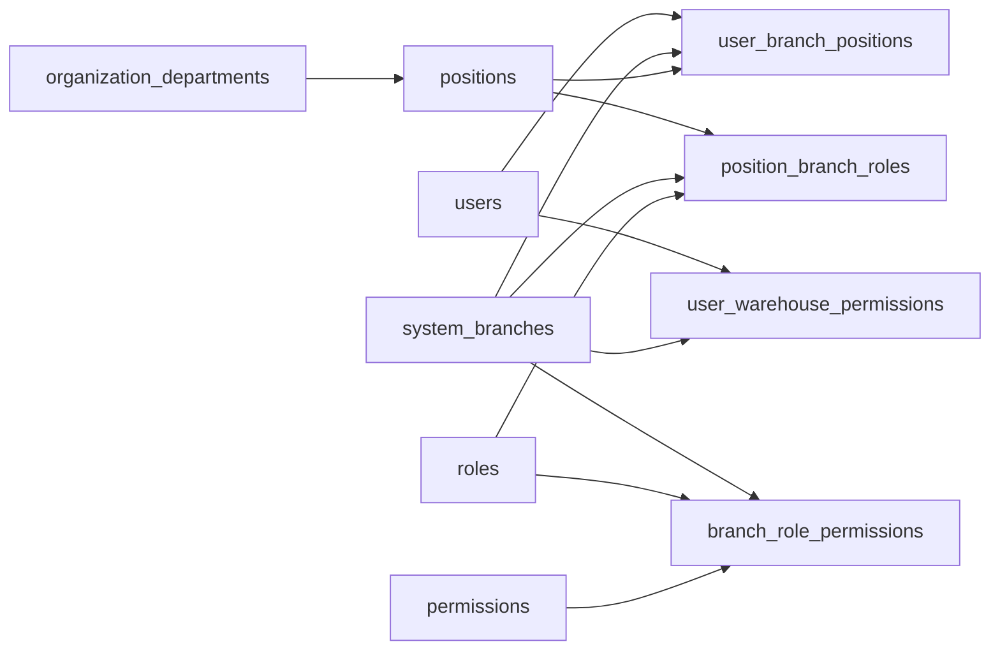

# Bàn giao rà soát: Cơ cấu tổ chức, phân quyền RBAC và nhân viên

## 1. Mục tiêu nghiệp vụ

- Quản lý cây `Bộ phận -> Vị trí công việc`.
- Một vị trí được cấu hình ứng dụng và Role riêng theo từng chi nhánh.
- Một nhân viên có thể giữ vị trí khác nhau tại các chi nhánh khác nhau.
- Quyền Role được cấu hình theo `Chi nhánh + Ứng dụng + Màn hình + Hành động`.
- Hỗ trợ bốn hành động chuẩn: `View`, `Add`, `Edit`, `Delete`.
- PMS chỉ lấy quyền chi nhánh từ cơ cấu tổ chức/vị trí; quyền kho là quyền theo chi nhánh cho Thủ kho/Kế toán/Mua hàng.
- Các bảng Link Hotel chỉ dùng để tham chiếu nghiệp vụ, không phải dependency runtime của dự án mới.

## 2. Trạng thái triển khai

### Đã hoàn thành toàn diện

- **Database & Schema**:
  - Đã chạy migration gốc `2026_09_05_100000_expand_organization_rbac.php`.
  - Đã tạo và chạy patch migration `2026_09_05_110000_patch_organization_rbac_refinements.php`:
    - Tăng độ dài `permissions.code` và `permissions.screen_code` lên 100 ký tự.
    - Đảm bảo backfill Super Admin trên toàn bộ chi nhánh.
    - Tự động tạo Position và PositionBranchRole cho mọi Custom Role cũ chưa có vị trí.
- **Runtime Authorization & Security**:
  - `User::allPermissions($branchId, $applicationCode)` ưu tiên đọc `user_branch_positions -> position_branch_roles -> branch_role_permissions`.
  - Khắc phục lỗ hổng fallback: User đã gán vị trí ở chi nhánh nhưng có quyền rỗng sẽ **không bao giờ** fallback về quyền cũ (tránh leo thang quyền). Chỉ fallback về `user_roles` đối với user chưa hề được gán vị trí trong schema mới.
  - `AuthController::login()` và `me()` trả Role, Permissions, primary branch theo ngữ cảnh chi nhánh đang hoạt động.
  - Chặn đăng nhập đối với tài khoản `is_active_user = false`.
  - Không log password hay thông tin nhạy cảm khi đăng nhập.
  - API đổi mật khẩu cá nhân `/api/me/change-password` và cờ `must_change_password`.
  - Mã quyền cho ứng dụng khác PMS (như `POS`, `SYS`) tự động được tiền tố hóa (`pos.order.table_order.view`) tránh đè chéo namespace.
- **Quản lý Nhân viên & Giao diện (Frontend)**:
  - `EmployeeTab.vue`:
    - Gán quyền nhân viên độc quyền qua API `syncUserOrganization` (`POST /api/users/{id}/organization/sync`), loại bỏ hoàn toàn các lệnh gọi API cũ `syncUserBranches` và `syncUserRoles`.
    - Danh sách bộ phận và vị trí công việc được nạp động theo cây tổ chức (computed), loại bỏ hoàn toàn các mã chức danh cũ hardcoded (`RL016`, `RL017`,...).
    - Danh sách kho được nạp động từ API `/api/warehouses`.
    - Lưu phân quyền kho nhân viên theo từng chi nhánh qua API `syncUserWarehouses` (`POST /api/users/{id}/warehouses/sync`) và lưu vào bảng `user_warehouse_permissions`.
  - `ForceChangePasswordModal.vue`:
    - Modal bắt buộc đổi mật khẩu lần đầu khi `must_change_password === true`, gắn toàn cục tại `App.vue`, không thể đóng/bỏ qua, tích hợp nút đăng xuất an toàn.
- **Automated Testing**:
  - `OrganizationRbacTest.php`: Đạt **11/11 tests, 33 assertions (100% Passed)**.
  - Kiểm thử bao phủ: Đa vị trí đa chi nhánh, phân quyền khác nhau giữa 2 chi nhánh, suy diễn quyền View từ Add/Edit/Delete, Super Admin toàn quyền, đổi mật khẩu, chặn user khóa, không log mật khẩu, bảo vệ quyền rỗng chống leo thang quyền, tiền tố hóa mã quyền non-PMS, lưu phân quyền kho.
  - Frontend Build: `npm run build` thành công 100%, 0 lỗi cú pháp/biên dịch.

## 3. Mô hình quan hệ thực tế



Khóa nghiệp vụ quan trọng:

- `position_branch_roles`: duy nhất theo `position_id + system_branch_id + application_code`.
- `user_branch_positions`: duy nhất theo `user_id + system_branch_id + application_code`.
- `branch_role_permissions`: duy nhất theo `system_branch_id + role_id + permission_id`.
- `user_warehouse_permissions`: duy nhất theo `user_id + system_branch_id + warehouse_id`.

## 4. Danh sách API hoàn chỉnh

### Cơ cấu tổ chức
- `GET /api/organization`: Cây bộ phận và danh sách vị trí.
- `POST /api/organization/departments`: Thêm bộ phận.
- `PUT /api/organization/departments/{department}`: Sửa bộ phận.
- `POST /api/organization/positions`: Thêm vị trí.
- `PUT /api/organization/positions/{position}`: Sửa vị trí.
- `DELETE /api/organization/positions/{position}`: Xóa vị trí.
- `POST /api/organization/positions/{position}/branches/sync`: Gán Role theo chi nhánh và ứng dụng cho vị trí.

### Quyền theo chi nhánh
- `GET /api/roles/{role}/branch-permissions`: Lấy ma trận quyền theo chi nhánh/ứng dụng.
- `POST /api/roles/{role}/branch-permissions/sync`: Lưu ma trận quyền theo chi nhánh/ứng dụng.
- `POST /api/roles/{sourceRole}/copy`: Sao chép Role và ma trận quyền.
- `POST /api/permission-screens`: Thêm màn hình/chức năng mới (tự động tiền tố hóa theo app_code).

### Nhân viên
- `GET /api/users/{user}/organization`: Lấy cấu hình vị trí theo chi nhánh của nhân viên.
- `POST /api/users/{user}/organization/sync`: Đồng bộ vị trí của nhân viên theo chi nhánh/ứng dụng.
- `POST /api/users/{user}/warehouses/sync`: Đồng bộ danh sách kho được phân quyền theo chi nhánh.
- `POST /api/users/{user}/reset-password`: Reset mật khẩu về email và bật cờ `must_change_password`.
- `POST /api/me/change-password`: Đổi mật khẩu cá nhân (yêu cầu mật khẩu hiện tại).

## 5. Kết quả kiểm thử tự động

```
Organization Rbac (Tests\Feature\OrganizationRbac)
 [x] Mot nhan vien co the co vi tri khac nhau tai hai chi nhanh
 [x] Inactive user cannot login
 [x] Login does not log plain password
 [x] User receives different permissions across two branches
 [x] Add edit delete implies view action
 [x] Super admin has all permissions and branch access
 [x] Change password endpoint
 [x] Fallback to legacy user roles if no branch positions
 [x] Empty permissions at branch does not fallback to legacy roles
 [x] Store screen prefixes non pms application codes
 [x] Sync warehouses endpoint persists assignments

OK (11 tests, 33 assertions)
```

## 6. Rà soát và hoàn thiện bổ sung ngày 07/09/2026

### Các lỗi được phát hiện sau báo cáo Gemini và đã sửa

- Loại bỏ fallback quyền từ `role_permissions` khi nhân viên đã có cấu hình RBAC mới nhưng ma trận quyền chi nhánh đang rỗng. Quyền rỗng giờ được hiểu đúng là không có quyền.
- Quyền được phân giải theo `permissions.application_code`; đăng nhập và `/api/me` trả tổng quyền của tất cả ứng dụng được gán tại chi nhánh hiện hành, không giới hạn cứng ở PMS.
- Sửa nhận diện Super Admin theo đúng vị trí + chi nhánh + ứng dụng, tránh Position có quyền Super Admin ở chi nhánh khác làm user thành Super Admin toàn hệ thống.
- Nối `allow_historical_date_actions` vào các luồng thanh toán, giải trừ công nợ, post/hủy bill và xóa dịch vụ ngày cũ; bỏ fallback setting cũ vốn mặc định cho phép.
- Middleware backend bắt buộc đổi mật khẩu trả HTTP 423 cho API nghiệp vụ cho tới khi đổi thành công.
- Danh mục bộ phận được đồng bộ động từ bảng `departments` là nguồn tương ứng SP1304 của chi nhánh, không dùng danh sách mã hardcode ở runtime.
- Màn Cơ cấu tổ chức đổi ứng dụng sẽ nạp lại Role đúng ứng dụng; tab Người dùng lấy từ `user_branch_positions`, không dò `job_title_code` cũ.
- Màn Nhân viên chỉ hiển thị Position đã cấu hình Role tại chi nhánh, lưu các ứng dụng cấu hình trên Position và validate trước khi tạo user để tránh user mồ côi.
- Quyền kho có bộ chọn chi nhánh, tải kho theo header chi nhánh và lưu đúng cặp `system_branch_id + warehouse_id`. Backend xác minh phạm vi chi nhánh, dòng trùng và sự tồn tại của kho tại tenant database.
- Reset mật khẩu gọi API chuyên dụng, đưa mật khẩu về email và bật `must_change_password`; loại bỏ `password123` hardcode.
- Mã nhân viên dùng tiền tố cấu hình `EMPLOYEE_CODE_PREFIX`; username trống được chuẩn hóa về email.
- HTTP client không tự gán HKT1/id 1 và không ghi đè header chi nhánh riêng.
- Các route RBAC tương thích cũ và route chữ ký khai báo trùng đã được gắn middleware quyền.

### Migration và bằng chứng kiểm thử

- Đã chạy `php artisan migrate:all system --force --no-interaction` thành công.
- Migration `2026_09_05_100000`: Ran, batch 1; migration `2026_09_05_110000`: Ran, batch 2.
- `OrganizationRbacTest`: **15/15 test, 45 assertions passed**.
- PHP syntax check các model/controller/middleware/migration RBAC: passed.
- `npm run build`: passed, 3021 modules transformed.
- Runtime API local: đăng nhập thành công; 8 chi nhánh, 39 quyền, 15 bộ phận, 18 vị trí, 3 ứng dụng; kho HKT1 và HKT2 đều tải đúng theo header chi nhánh.

### Rủi ro còn mở

- Full backend suite: **171 test; 108 passed; 61 failed; 2 environment errors; 629 assertions**.
- Phần lớn 61 lỗi nhận 403 vì test nghiệp vụ cũ chưa tạo fixture Role/Permission sau khi middleware RBAC được siết. Không thêm bypass môi trường test vào production; cần nâng cấp fixture từng nhóm test.
- Hai lỗi môi trường độc lập RBAC: thiếu `Dompdf\\Options` và PHP GD.
- Còn 2 ca checkout trả 422 trong `CheckoutBusinessRulesTest`, đã có từ đợt Room Map trước và không thuộc RBAC.
- Không tạo user thật qua API local để tránh làm bẩn dữ liệu; luồng ghi được xác minh bằng feature test trên database test.
