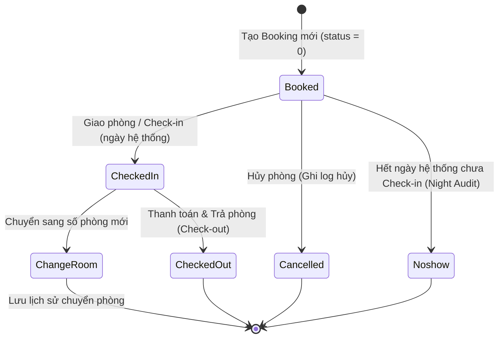
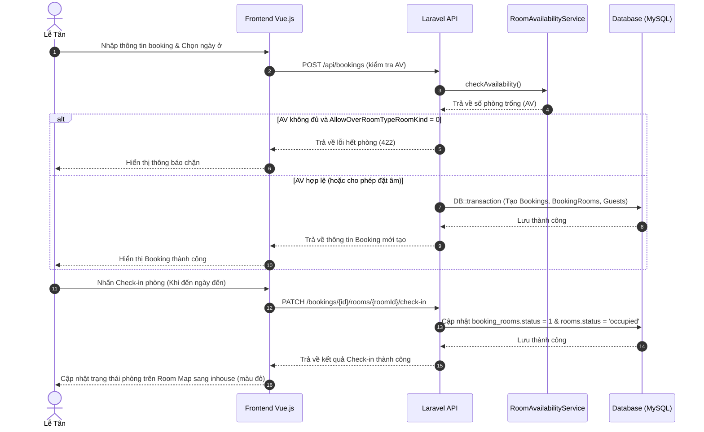

# BÁO CÁO PHÂN TÍCH CHI TIẾT MODULE BOOKING (ĐẶT PHÒNG)

Báo cáo này cung cấp thông tin phân tích đầy đủ và chi tiết về module **Booking (Đăng ký/Đặt phòng)** của hệ thống quản lý khách sạn (PMS), được chuyển đổi từ SQL Server sang MySQL/Laravel + Vue.js.

---

## 1. TỔNG QUAN MODULE

### 1.1. Mục đích và vai trò
Module Booking đóng vai trò lõi trong hệ thống PMS, chịu trách nhiệm quản lý toàn bộ vòng đời của một giao dịch lưu trú:
*   **Tiếp nhận đặt phòng:** Lưu thông tin đặt phòng ban đầu của khách lẻ (FIT) hoặc khách đoàn (GIT), thông tin công ty, nguồn khách và chi tiết thanh toán/đặt cọc.
*   **Phân bổ buồng phòng:** Gán số phòng vật lý, tự động phân phòng trống, quản lý thay đổi ngày ở, giường phụ (extra bed), và các yêu cầu dịch vụ đặc biệt.
*   **Quản lý lưu trú:** Thực hiện giao phòng (check-in), thay đổi phòng (room transfer), nâng/hạ hạng phòng, quản lý thông tin khách thực tế lưu trú.
*   **Chốt ca / Trả phòng:** Thực hiện thanh toán hóa đơn tạm tính, đối trừ tiền đặt cọc và trả phòng (check-out) hoàn tất quy trình lưu trú.

### 1.2. Mối liên quan và phụ thuộc với các module khác
Module Booking là trung tâm kết nối các phân hệ vận hành khác trong PMS:
*   **Module Rooms (Quản lý phòng):** Booking liên kết trực tiếp với bảng phòng vật lý `rooms` để gán số phòng và thay đổi trạng thái phòng (clean/dirty/occupied/checkout).
*   **Module Guests (Quản lý khách):** Tách biệt thông tin khách lưu trú (`guests`) để tái sử dụng và quản lý khai báo tạm trú (Residence Declaration).
*   **Module Service Bills & Payments (Hóa đơn & Thanh toán):** Folio hóa đơn (`service_bills`) và giao dịch thanh toán/đặt cọc (`payments`) liên kết chặt chẽ với booking để tính toán công nợ khi check-out.
*   **Phân hệ Night Audit (Chốt ngày):** Dựa trên dữ liệu booking để tự động post tiền phòng đêm (`RM`), phụ thu ăn sáng trẻ em (`BD`), extra bed (`EB`) và cập nhật ngày nghiệp vụ hệ thống.
*   **Quản lý Khóa phòng (Room Locks):** Kiểm tra các khoảng phòng bị khóa bảo trì (OOO/OOS) để loại trừ khi tính phòng trống (AV) hoặc gán số phòng.

---

## 2. PHÂN TÍCH NGHIỆP VỤ (BUSINESS LOGIC)

### 2.1. Các Use Case chính
1.  **Tạo mới đặt phòng:** Tiếp nhận thông tin booking header và danh sách phòng phân bổ (`room_allocations`), tự động tính toán ngày xác nhận (`confirm_date`) dựa trên loại đặt phòng (Guaranteed / Non-guaranteed).
2.  **Cập nhật nhanh nhiều phòng (Bulk Update):** Thay đổi hàng loạt ngày đến/đi, giá phòng, số người lớn/trẻ em, extra bed cho các phòng chưa check-out.
3.  **Tự động gán số phòng (Auto Assignment):** Tìm số phòng vật lý còn trống liên tục trong giai đoạn khách ở, ưu tiên từ tầng thấp lên tầng cao.
4.  **Giao phòng (Check-in):** Chuyển trạng thái sang in-house khi đến ngày hệ thống, yêu cầu phòng vật lý phải sẵn sàng (clean/ready).
5.  **Chuyển phòng (Room Move/Transfer):** Thay đổi phòng cho khách đang lưu trú, tự động chia tách folio hóa đơn và chuyển các dịch vụ tương lai sang phòng mới.
6.  **Nâng/hạ hạng phòng (Room Upgrade/Downgrade):** Thay đổi loại phòng đăng ký của khách, giữ lại thông tin loại phòng gốc khởi tạo ban đầu.
7.  **Khóa phòng không di chuyển (Do Not Move):** Khóa cố định số phòng đã gán, chỉ cho phép người khóa hoặc user có quyền đặc quyền mở khóa.
8.  **Hủy phòng / Hủy đăng ký (Cancel Booking):** Cascade cập nhật trạng thái hủy sang toàn bộ phòng lưu trú, khách đi kèm và ghi log lý do hủy.
9.  **Chi tiết ăn sáng trẻ em:** Quản lý chi tiết ăn sáng/phụ thu trẻ em từng ngày, phân biệt em bé (baby - miễn phí) và trẻ em (child - tính phí).
10. **Đặt cọc (Deposit):** Nhận tiền đặt cọc từ khách, cấu hình không cho phép hình thức thanh toán công nợ (debt) khi đặt cọc.
11. **Trả phòng (Check-out):** Trả phòng cho khách lưu trú lẻ hoặc toàn bộ booking đoàn sau khi đã thanh toán hết hóa đơn và đối trừ tiền cọc.

### 2.2. Quy tắc nghiệp vụ (Business Rules)
*   **Ngày đến hợp lệ:** Ngày check-in của booking mới phải `>= system_date` (ngày nghiệp vụ của khách sạn lấy từ bảng `system_date_rolls`), không được lấy ngày giờ của máy chủ hay máy trạm client.
*   **Kiểm tra phòng trống (AV - Availability):** 
    $$AV = Tổng\ số\ phòng\ vật\ lý\ (is\_internal=0) - Phòng\ khóa\ (OOO/OOS) - Phòng\ bận\ (Booked/Inhouse)$$
    *   *Điều kiện bận (Overlap):* Một phòng/loại phòng bị coi là bận trong giai đoạn $[Arrival_{new}, Departure_{new})$ nếu có booking khác thoả mãn: 
        $$Arrival_{other} < Departure_{new} \quad\text{AND}\quad Departure_{other} > Arrival_{new}$$
    *   *Cấu hình chặn âm phòng:* Tham số `AllowOverRoomTypeRoomKind`:
        *   Nếu `= 0`: Hệ thống chặn không cho tạo/sửa booking nếu số lượng vượt quá AV (AV hiển thị màu đỏ trên UI).
        *   Nếu `= 1`: Hệ thống cho phép đặt âm phòng kèm theo cảnh báo xác nhận.
*   **Tự động gán phòng (Auto Assignment):** Số phòng được chọn phải còn trống liên tục trong toàn bộ khoảng lưu trú. Thuật toán ưu tiên gán phòng từ tầng thấp lên tầng cao.
*   **Khóa Do Not Move:** Khi bật cờ `is_do_not_move = 1`, hệ thống chặn mọi thao tác đổi số phòng (bao gồm kéo thả trên sơ đồ Room Map). Việc mở khóa yêu cầu đúng user đã khóa thực hiện, trừ khi user hiện tại có tên trong danh sách cấu hình `Booking_RuleUserUnLockDoNotMove`.
*   **Phụ thu ăn sáng trẻ em (BD):** 
    *   Baby: Mặc định miễn phí, không tạo bill dịch vụ phụ thu.
    *   Child: Dựa vào cấu hình `Booking_AutoExtraChargeBFChild`. Nếu bật và chọn `is_extra_charge = 1`, hệ thống tự động tạo bill dịch vụ phụ thu mã `BD` với đơn giá từ cấu hình `GiaAnSangTreEm`.
    *   Phân bổ tài chính: FIT (`post_to_room = 1`) chuyển hóa đơn về Folio phòng; GIT (`post_to_room = 0`) chuyển về Folio booking header (đoàn).

### 2.3. Các trạng thái Booking & Sơ đồ State Machine

#### 2.3.1. Trạng thái Booking (`bookings.status`)
*   `0` (STATUS_RESERVATION): Đăng ký đặt phòng (chưa check-in).
*   `1` (STATUS_CHECKIN): Đã check-in (ít nhất 1 phòng đang in-house).
*   `2` (STATUS_CHECKOUT): Đã checkout toàn bộ phòng và hoàn tất hóa đơn.
*   `3` (STATUS_DELETED): Đã hủy/xóa booking.
*   `4` (STATUS_NO_SHOW): Khách không đến.

#### 2.3.2. Trạng thái Phòng Đặt (`booking_rooms.status`)
*   `0` (STATUS_BOOKED): Phòng được đặt trước, chưa check-in.
*   `1` (STATUS_CHECKED_IN): Khách đang ở (in-house).
*   `2` (STATUS_CHECKED_OUT): Phòng đã checkout.
*   `3` (STATUS_CANCELLED): Phòng đã hủy.
*   `4` (STATUS_NOSHOW): Phòng noshow.
*   `100` (STATUS_TRANSFER): Phòng đã làm thủ tục chuyển sang số phòng mới (lưu lịch sử).

#### 2.3.3. Sơ đồ chuyển trạng thái của Booking Room


### 2.4. Các trường hợp đặc biệt / Ngoại lệ nghiệp vụ (Edge Cases)

#### 2.4.1. Chuyển phòng (Room Move / Transfer)
Khi khách đang inhouse đổi số phòng, logic xử lý bao gồm:
1.  Tách folio: Chốt ngày đi của phòng cũ bằng ngày hệ thống (`departure_date = system_date`, trạng thái = `CheckedOut`, lưu `move_room` trỏ tới phòng mới).
2.  Tạo dòng phòng mới: Tạo một bản ghi `booking_rooms` mới với số phòng mới, ngày đến bằng ngày hệ thống, trạng thái `CheckedIn`.
3.  Di chuyển thông tin đi kèm:
    *   Sao chép toàn bộ khách lưu trú (`booking_room_guests`) sang phòng mới.
    *   Cập nhật trẻ em (`booking_children`) sang phòng mới.
    *   Di chuyển tất cả các dịch vụ tự động bổ sung (`booking_room_services`) có ngày sử dụng `>= system_date` sang phòng mới.

#### 2.4.2. Trả phòng sớm (Early Check-out)
Xảy ra khi khách check-out trước ngày đi dự kiến (`departure_date > system_date`).
*   **Kiểm tra cấu hình:** Hệ thống đọc config `AllowEarlyCheckout`. Nếu `= 0`, chặn không cho check-out sớm.
*   **Xử lý tài chính:** Nếu cấu hình cho phép, hệ thống yêu cầu người vận hành phải thực hiện charge tiền phòng các đêm còn lại trước (hoặc xác nhận miễn phí) để đưa tiền phòng vào bill trước khi checkout.
*   **Chặn checkout:** Hệ thống chặn checkout nếu:
    *   Còn hóa đơn dịch vụ/tiền phòng chưa thanh toán.
    *   Còn tiền đặt cọc (`payments`) chưa được đối trừ hết về Folio hoặc hoàn trả khách.

#### 2.4.3. Khôi phục Trả phòng (Undo / Restore Checkout)
Khôi phục trạng thái inhouse cho phòng đã check-out lỡ tay.
*   **Điều kiện khôi phục:**
    *   Chỉ cho phép khôi phục trong đúng ngày hệ thống hiện tại (`CheckoutDate = system_date`).
    *   Số phòng vật lý đó tại thời điểm khôi phục phải đang trống (không bị booking khác check-in đè lên).
    *   Phòng không nằm trong lịch khóa bảo trì (OOO/OOS) bắt đầu từ hôm nay.
*   **Thao tác hệ thống:** Khôi phục trạng thái `1` (Checked In) cho phòng thuê và nhóm khách lưu trú cùng thời điểm checkout sau cùng, trả lại trạng thái phòng vật lý thành `occupied`.

#### 2.4.4. Xử lý Trùng lịch & Concurrency (Race Condition)
Khi 2 lễ tân cùng tạo booking hoặc gán phòng cho cùng 1 phòng vật lý/loại phòng tại một thời điểm:
*   Hệ thống kiểm tra AV tại thời điểm ghi dữ liệu bằng Transaction.
*   Khi gán phòng vật lý, thực hiện lock bản ghi phòng bận để tránh trạng thái race condition (Double Booking).

---

## 3. KIẾN TRÚC & CẤU TRÚC CODE

### 3.1. Cấu trúc thư mục và file liên quan

```
DỰ ÁN PMS
├── backend (Laravel API)
│   ├── app
│   │   ├── Http
│   │   │   └── Controllers
│   │   │       └── Api
│   │   │           ├── BookingController.php (Quản lý chung booking, tạo mới, dropdowns)
│   │   │           ├── BookingRoomController.php (Gán phòng, bulk update, Check-in, khóa Move, nâng hạng)
│   │   │           ├── GuestController.php (Khai báo khách lưu trú, Check-out phòng/booking, khôi phục check-out)
│   │   │           └── NightAuditController.php (Đóng ngày, xử lý Noshow / Late Checkin, post tiền phòng tự động)
│   │   ├── Models
│   │   │   ├── Booking.php (Model bookings - SP2000)
│   │   │   ├── BookingRoom.php (Model chi tiết phòng đặt - SP2100)
│   │   │   ├── BookingRoomGuest.php (Pivot gán khách vào phòng - SP2200)
│   │   │   ├── Guest.php (Model thông tin khách lưu trú - SP2300)
│   │   │   ├── BookingChild.php (Model trẻ em đi kèm - SP2400)
│   │   │   ├── BookingChildBreakfastDetail.php (Chi tiết ăn sáng trẻ em - SP2401)
│   │   │   └── BookingRoomService.php (Dịch vụ tự động / extra bed - SP2102)
│   │   └── Services
│   │       └── RoomAvailabilityService.php (Service kiểm tra phòng trống AV & check trùng phòng vật lý)
│   └── database
│       └── migrations
│           ├── 2026_07_06_140000_create_bookings_table.php (Bảng bookings)
│           ├── 2026_07_08_100000_create_booking_rooms_table.php (Bảng booking_rooms)
│           ├── 2026_07_08_100001_create_booking_room_services_table.php (Bảng booking_room_services)
│           └── 2026_07_08_100006_create_guest_tables.php (Các bảng guests, booking_room_guests, booking_children)
│
└── frontend (Vue.js 3 + Vite)
    └── src
        ├── services
        │   └── booking-service.js (Các hàm gọi API Axios cho toàn bộ nghiệp vụ booking)
        └── pages
            └── reservation
                ├── CreateRegistrationPage.vue (Trang tạo đặt phòng mới)
                ├── RoomMapPage.vue (Sơ đồ phòng trực quan, check-in, đổi phòng nhanh)
                ├── RoomPlanPage.vue (Grid sơ đồ AV phòng, xem công suất phòng)
                └── components
                    ├── GuestInfoModal.vue (Modal nhập thông tin khách)
                    ├── UpgradeModal.vue (Modal nâng hạng phòng)
                    └── DepositModal.vue (Modal cọc tiền)
```

### 3.2. Các API / Endpoint chính (backend/routes/api.php)

| Method | Endpoint | Controller Method | Mô tả nghiệp vụ |
| :--- | :--- | :--- | :--- |
| **GET** | `/api/bookings` | `BookingController@index` | Lấy danh sách booking (có filter tìm kiếm, ngày đến/đi, status) |
| **GET** | `/api/bookings/init-dropdowns` | `BookingController@initDropdowns` | Lấy danh mục phục vụ vẽ UI tạo booking (Company, Market, RoomClass, v.v.) |
| **POST** | `/api/bookings` | `BookingController@store` | Tạo mới booking (kèm validate phòng trống AV và tạo phòng con) |
| **PUT** | `/api/bookings/{id}` | `BookingController@update` | Chỉnh sửa thông tin chung của booking header |
| **DELETE** | `/api/bookings/{id}` | `BookingController@destroy` | Hủy toàn bộ booking (lưu lý do hủy và cập nhật cascade trạng thái) |
| **POST** | `/api/bookings/{bookingId}/auto-assign` | `BookingRoomController@autoAssign` | Tự động gán số phòng vật lý cho phòng đặt chưa gán số |
| **PATCH** | `/api/bookings/{bookingId}/rooms/{roomId}/unassign` | `BookingRoomController@unassign` | Gỡ số phòng vật lý khỏi phòng đặt (trả về trạng thái chờ gán) |
| **PATCH** | `/api/bookings/{bookingId}/rooms/{roomId}/check-in` | `BookingRoomController@checkIn` | Check-in phòng đặt (yêu cầu phòng trống, ngày đến = ngày hệ thống) |
| **POST** | `/api/bookings/{bookingId}/rooms/{roomId}/undo-checkin` | `BookingRoomController@undoCheckIn` | Hoàn tác check-in phòng (trả về trạng thái Booked ban đầu) |
| **PATCH** | `/api/bookings/{bookingId}/rooms/{roomId}/upgrade` | `BookingRoomController@upgrade` | Nâng/hạ hạng phòng của booking (cập nhật loại phòng, giữ LP khởi tạo) |
| **POST** | `/api/bookings/{bookingId}/rooms/{roomId}/lock-move` | `BookingRoomController@lockMove` | Khóa phòng Do Not Move (không cho đổi số phòng) |
| **DELETE** | `/api/bookings/{bookingId}/rooms/{roomId}/lock-move` | `BookingRoomController@unlockMove` | Mở khóa phòng Do Not Move |
| **POST** | `/api/bookings/{bookingId}/rooms/{roomId}/move` | `BookingRoomController@moveRoom` | Thực hiện chuyển phòng (đổi phòng vật lý cho phòng đang ở) |
| **POST** | `/api/booking-rooms/{roomId}/checkout` | `GuestController@checkoutRoom` | Thanh toán & Trả phòng đơn lẻ (checkout theo phòng) |
| **POST** | `/api/bookings/{bookingId}/checkout` | `GuestController@checkoutBooking` | Checkout toàn bộ Master (dành cho đoàn GIT) |
| **POST** | `/api/booking-rooms/{roomId}/restore-checkout` | `GuestController@restoreRoomCheckout` | Khôi phục check-out phòng lỡ tay trong ngày hệ thống |

### 3.3. Database Schema chi tiết các bảng lõi

#### 3.3.1. Bảng `bookings` (SP2000 - DangKy)
Lưu trữ thông tin đầu bảng (Header) của một lượt đặt phòng:
*   `id` (BIGINT, PK): ID tự tăng trong MySQL.
*   `booking_name` (VARCHAR): Tên đăng ký đại diện (viết HOA).
*   `arrival_date`, `departure_date` (DATE): Khoảng ngày lưu trú bao quát của cả booking.
*   `num_of_days` (SMALLINT): Tổng số đêm lưu trú.
*   `booking_date` (DATE): Ngày tạo booking, ghi nhận theo `system_date`.
*   `status` (TINYINT): Trạng thái vận hành tổng (0=Reservation, 1=CheckedIn, 2=CheckedOut, 3=Deleted, 4=NoShow).
*   `registration_status_id` (FK): Trỏ sang bảng tình trạng đặt phòng `registration_statuses` (Guaranteed, Tentative, ...).
*   `company_id` (FK, Nullable): Trỏ sang `companies` (lữ hành/đối tác).
*   `market_id` (FK), `customer_source_id` (FK): Segment thị trường và nguồn khách.
*   `is_git` (BOOLEAN): Phân loại đoàn GIT (1) hay khách lẻ FIT (0).

#### 3.3.2. Bảng `booking_rooms` (SP2100 - PhongThue)
Chi tiết từng phòng thuê trong booking. Một booking có thể có nhiều phòng:
*   `id` (VARCHAR, PK): Mã phòng thuê định dạng chuỗi sinh theo quy luật (ví dụ: `G0000001`).
*   `booking_id` (FK): Liên kết tới bảng `bookings`.
*   `room_number` (VARCHAR, Nullable): Số phòng vật lý được gán (trỏ tới `rooms.room_number`). Null nếu chưa gán phòng.
*   `room_class_id` (FK): Loại phòng hiện tại (Standard, Deluxe, ...).
*   `original_room_class_id` (VARCHAR): Loại phòng đặt khởi tạo ban đầu, dùng để đối chiếu khi nâng hạng.
*   `arrival_date`, `departure_date` (DATE): Ngày đến/đi riêng của phòng này.
*   `ActutalNumOfDays` (INT): Số đêm ở của phòng.
*   `rate` (DECIMAL): Giá phòng một đêm.
*   `status` (TINYINT): Trạng thái phòng đặt (0=Booked, 1=Inhouse, 2=Checkout, 3=Cancelled, 4=Noshow, 100=Transferred).
*   `is_do_not_move` (TINYINT): Cờ khóa phòng không di chuyển (1 = Khóa).

#### 3.3.3. Bảng `booking_room_guests` (SP2200 - PhongThueKhach)
Bảng pivot trung gian quản lý khách người lớn trong từng phòng:
*   `id` (BIGINT, PK): ID tự tăng.
*   `booking_room_id` (FK): Trỏ tới `booking_rooms.id`.
*   `guest_id` (FK): Trỏ tới `guests.id`.
*   `is_primary` (BOOLEAN): Khách đại diện phòng (1 = Đại diện chính).
*   `actual_arrival_date`, `actual_checkout_date` (DATE): Ngày thực tế khách đến/checkout.
*   `status` (TINYINT): Trạng thái lưu trú của khách (0=Active, 2=CheckedOut, 3=Cancelled).

#### 3.3.4. Bảng `booking_children` (SP2400 - TreEm)
Quản lý thông tin trẻ em đi kèm đặt phòng:
*   `id` (VARCHAR, PK): ID trẻ em.
*   `booking_id` (FK), `booking_room_id` (FK): Liên kết với booking và phòng được gán.
*   `full_name` (VARCHAR): Họ tên trẻ em.
*   `age_group` (ENUM): Phân loại trẻ em (`baby` = em bé < 4 tuổi, `child` = trẻ em 4-12 tuổi).
*   `child_status` (TINYINT): Trạng thái (0=Active, 2=CheckedOut, 3=Cancelled).

#### 3.3.5. Bảng `booking_child_breakfast_details` (SP2401 - TreEmAnSangChiTiet)
Chi tiết ăn sáng trẻ em theo từng ngày:
*   `booking_child_id` (FK): Liên kết tới `booking_children`.
*   `service_date` (DATE): Ngày ăn sáng.
*   `breakfast` (BOOLEAN): 1 = Có ăn sáng.
*   `is_free` (BOOLEAN): 1 = Miễn phí ăn sáng.
*   `is_extra_charge` (BOOLEAN): 1 = Tạo bill phụ thu dịch vụ tự động (mã `BD`).
*   `amount` (DECIMAL): Đơn giá ăn sáng trẻ em.

#### 3.3.6. Bảng `booking_room_services` (SP2102 - PhongThueDichVuTuDong)
Dịch vụ tự động post hàng ngày (bao gồm cả Extra Bed và tiền phòng chi tiết):
*   `booking_room_id` (FK): Liên kết phòng đặt.
*   `service_code` (VARCHAR): Mã dịch vụ (RM, EB, BD, hoặc dịch vụ FO khác).
*   `service_date` (DATE): Ngày áp dụng dịch vụ.
*   `quantity` (DECIMAL), `rate` (DECIMAL): Số lượng và đơn giá.
*   `is_posted` (TINYINT): Trạng thái đã post sang hóa đơn Folio (0 = Chưa post, 1 = Đã post).

---

## 4. LUỒNG XỬ LÝ (FLOW)

### 4.1. Luồng nghiệp vụ chính của một Booking
1.  **Tạo Đặt phòng (Reservation):** User tạo booking mới trên trang [CreateRegistrationPage.vue](file:///d:/PMS/frontend/src/pages/reservation/CreateRegistrationPage.vue). Backend kiểm tra AV thông qua [RoomAvailabilityService](file:///d:/PMS/backend/app/Services/RoomAvailabilityService.php). Nếu thoả mãn, hệ thống tạo bản ghi trong `bookings` và `booking_rooms`, gán khách chính vào `booking_room_guests`.
2.  **Đặt cọc (Deposit):** Khách thanh toán cọc trước. Giao dịch được lưu vào bảng `payments` gắn với `booking_id`.
3.  **Gán phòng vật lý (Assign Room):** Lễ tân thực hiện gán phòng tự động (Auto Assign) hoặc chọn thủ công số phòng trống trên sơ đồ phòng.
4.  **Nhận phòng (Check-in):** Khi đến ngày đến nghiệp vụ (`arrival_date == system_date`), lễ tân thực hiện Check-in. Trạng thái phòng gán đổi sang `occupied`, trạng thái `booking_rooms` đổi sang `1` (CheckedIn).
5.  **Vận hành & Phát sinh dịch vụ:** Trong quá trình khách ở, có thể phát sinh:
    *   *Room Move:* Chuyển khách sang phòng khác.
    *   *Post Service:* Thêm dịch vụ thủ công hoặc tự động post tiền phòng/dịch vụ set-up hàng đêm qua Night Audit.
6.  **Trả phòng & Thanh toán (Check-out):** Khách trả phòng. Lễ tân vào trang hóa đơn, đối trừ tiền cọc, tạo bill thanh toán công nợ còn thiếu. Thực hiện checkout room/booking. Trạng thái phòng đổi sang `checkout` (chờ dọn dẹp), trạng thái booking đổi sang `2` (CheckedOut).

### 4.2. Sơ đồ tuần tự luồng vận hành


---

## 5. ĐÁNH GIÁ & VẤN ĐỀ TIỀM ẨN

### 5.1. Vấn đề Concurrency & Race Condition
*   **Mô tả:** Khi nhiều lễ tân cùng thao tác đặt phòng hoặc gán phòng vật lý cho một phòng cụ thể tại cùng một thời điểm, có khả năng xảy ra tình trạng "Double Booking" (gán cùng 1 phòng vật lý cho 2 booking trùng khoảng ngày ở) nếu việc kiểm tra và ghi dữ liệu không được đồng bộ hóa.
*   **Giải pháp hiện tại:** Trong code Laravel, việc tạo booking, gán phòng và check-in đã được bọc trong `DB::transaction`. Tuy nhiên, chỉ transaction thông thường (Read Committed) không ngăn được hiện tượng một transaction khác đọc phòng trống trước khi transaction đầu tiên kịp commit.
*   **Đề xuất:**
    *   Sử dụng cơ chế **Pessimistic Locking** (`lockForUpdate()`) trong Laravel khi truy vấn kiểm tra số phòng trống vật lý trong khoảng ngày ở.
    *   Tạo index unique trên DB nếu có thể (nhưng do khoảng ngày là liên tục nên index unique cứng của SQL khó áp dụng, bắt buộc lock theo dòng hoặc dùng cơ chế kiểm tra đồng thời ở tầng ứng dụng).

### 5.2. Vấn đề hiệu năng khi tính Grid Availability (AV Grid)
*   **Mô tả:** Khi hiển thị màn hình Sơ đồ công suất phòng (Room Plan Grid) với khoảng thời gian dài (ví dụ: xem AV của 30 ngày cho 10 loại phòng), phương thức `getAvailabilityGrid` trong [RoomAvailabilityService.php](file:///d:/PMS/backend/app/Services/RoomAvailabilityService.php) thực hiện vòng lặp `while ($current->lt($end))` để tính toán cho từng ngày. Việc này có thể tạo ra nhiều thao tác lọc dữ liệu trong Collection.
*   **Đánh giá:** Code hiện tại đã tối ưu bằng cách tải trước toàn bộ `$bookings` và `$locks` trong khoảng thời gian lớn, sau đó dùng hàm `filter()` của Laravel Collection trong bộ nhớ để đếm số lượng phòng bận cho từng ngày. Điều này giúp giảm số lượng truy vấn DB xuống tối thiểu (chỉ còn 2 query DB lớn cho bookings và locks), tránh được lỗi N+1 Query. Tuy nhiên, nếu số lượng booking đang hoạt động cực lớn (hàng vạn bản ghi), việc lọc trong PHP có thể tốn bộ nhớ RAM.
*   **Đề xuất:** Cần theo dõi dung lượng bộ nhớ sử dụng của ca làm việc và áp dụng cache ngắn hạn (Redis) cho bảng lưới AV nếu tần suất truy cập sơ đồ phòng của nhân viên lễ tân quá cao.

### 5.3. Độ tin cậy của So sánh Ngày nghiệp vụ
*   **Mô tả:** Hệ thống PMS quản lý ngày theo Ngày nghiệp vụ khách sạn (`system_date`), đóng ca sang ngày mới thông qua Night Audit chứ không theo ngày vật lý thực tế của máy chủ.
*   **Đánh giá:** Code backend đã tuân thủ nghiêm ngặt việc lấy ngày nghiệp vụ qua [RoomAvailabilityService@getSystemDate](file:///d:/PMS/backend/app/Services/RoomAvailabilityService.php#L168-L179), giúp đồng bộ hóa toàn bộ so sánh ngày của Booking, Check-in, Check-out và Post dịch vụ. Đây là điểm cộng lớn về mặt kiến trúc nghiệp vụ khách sạn.

---

## 6. KẾT LUẬN & ĐỀ XUẤT CẢI THIỆN
Module Booking hiện tại đã được cấu trúc rất bài bản, ánh xạ chuẩn xác từ hệ thống PMS cũ (SQL Server) sang kiến trúc hiện đại (Laravel + Vue.js), đáp ứng đầy đủ các nghiệp vụ khách sạn từ đơn giản đến nâng cao:
1.  **Ưu điểm:**
    *   Cấu trúc dữ liệu chuẩn hóa, quan hệ rõ ràng giữa Booking header và các phòng con (`booking_rooms`), tách biệt dữ liệu khách (`guests`) để khai báo tạm trú và lưu trữ lịch sử lưu trú tốt.
    *   Quản lý chặt chẽ logic chuyển phòng (Room Move) và khôi phục check-out lỡ tay (Undo Checkout) - vốn là các điểm nóng dễ gây lỗi lệch doanh thu và trạng thái phòng trong vận hành thực tế.
    *   Tách biệt logic tính toán phòng trống (AV) vào một Service dùng chung để tái sử dụng thống nhất ở nhiều chức năng.
2.  **Khuyến nghị:**
    *   Tích hợp thêm cơ chế khóa đồng thời (Pessimistic lock) khi gán phòng vật lý để triệt tiêu hoàn toàn rủi ro trùng phòng vật lý do thao tác đồng thời.
    *   Tối ưu hóa giao diện hiển thị các cảnh báo âm phòng rõ ràng hơn cho người dùng trước khi lưu booking.
